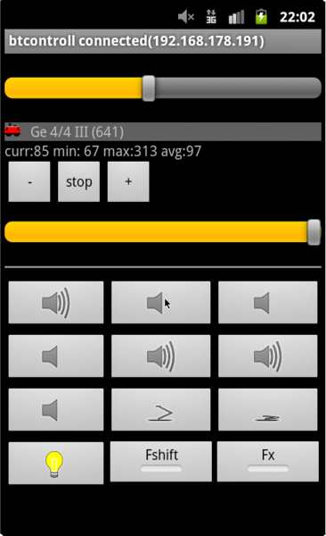
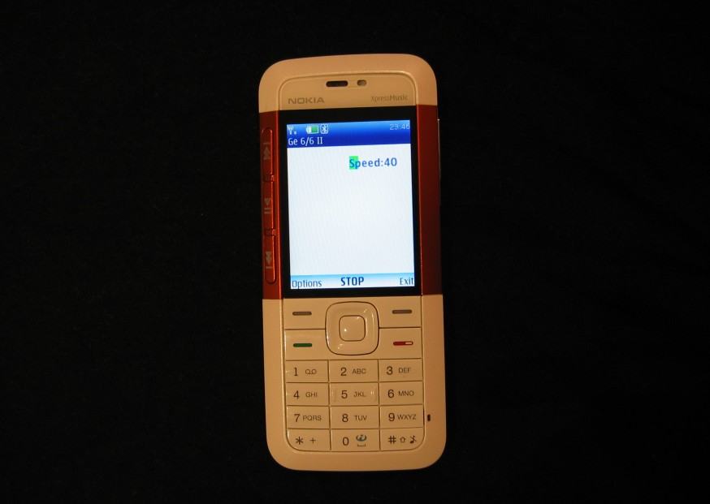

# btcontroll 

Modelleisenbahn übers Handy/Smartphone drahtlos steuern!
Entweder mit einem Raspberry Pi in der Lok selbst (das ist nur für die Gartenbahn interessant) oder über SRCPD und einen Booster eine DCC Lok ansterern. Bei Midp (die alten Nokias) verwende ich Bluetooth, für Android ist derzeit nur Wlan als Kommunikationsmedium eingebaut.

Diese Software ist meine private Spielerei, es sind jedoch alle herzlich willkommen den Code zu begutachten, auszuprobieren und Ideen beizutragen. Sollte allerdings irgendwas beschädigt werden ist jeder selbst schuld und ich lehne jegliche Verantwortung ab.

Project home: https://github.com/ferbar/btcontrol/

## bluetoothserver
Vermittlungsstelle Bluetooth/Wlan -> Hardware
Unterstütze Hardware:
* SRCPD (mit MERG - Booster)
* Raspberry PI PWM oder mit einer USB Platine

Siehe [bluetoothserver/](bluetoothserver/)

## control-android

Android App



siehe [control-android/](control-android/).
download [btcontrol.apk](../../raw/master/control-android/bin/btcontrol.apk)

## control-midp
Ein MIDP - java Programm welches aufs Handy (altes Nokia feature-phone) gehört

Siehe [readme](control-midp/README.md).
Die App ist unter /dist/btcontroll.jar



### midptestenv
Emulator um MIDP Programme am PC rennen zu lassen (zum Testen ganz nett, hat aber Bugs)

## control-esp32
Control Pad Hardware mit einem ESP32. siehe [control-esp32](control-esp32)


## ESP32 Lok - Elektronik
Für Akku Loks mit einem ESP32, siehe [esp32-server](esp32-server)


## NB1A_partlist.txt
Partlist für den http://merg.co.uk - booster

## usb k8055
Lib um eine Viessman - platine anzusteuern, früher für PWM verwendet (ohne DCC)

## ussp-push-0.11
ussp-push -> ussp-push-0.11/src/ussp-push
obex - push programm, programm um dateien über bluetooth an ein handy zu senden
ussp-push 00:11:22:33:44:55@ btcontrol.jar btcontrol.jar

## Raspberry PI

allgemeine Probleme:

* Uhrzeit falsch:
```
ntpd -gq
```
hint: raspberry pi3 + wlan + ntp hat einen Bug, siehe google suche nach TOS flag

* Bluetooth funktioniert nicht:

bluez 5 hat neues Interface um ein Service zu registrieren, siehe lib/systemd/system/bluetooth.service

### raspbian aufräumen:
 
```
 apt-get remove --purge wolfram-engine triggerhappy anacron logrotate dphys-swapfile xserver-common lightdm x11-utils xinit x11-xkb-utils xdg-utils x11-common \
 libreoffice libreoffice-core libreoffice-common \
 nodered supercollider freepats omxplayer scratch \
 oracle-java8-jdk bluej greenfoot \
 lxde-common lxde-icon-theme lxterminal lxpanel-data \
 libx11-6 libgtk-3-0 libgtk2.0-0 gtk2-engines leafpad gpicview galculator xarchiver alacarte \
 fonts-dejavu-extra fonts-sil-gentium-basic
 liblapack3 libv8-3.14.5 nodejs python3.4-minimal libpython3.4-stdlib pypy
 libgstreamer1.0-0 libgl1-mesa-glx libgles1-mesa libgles2-mesa libglapi-mesa
 plymouth

 apt-get autoremove --purge

 apt-get install vim
 update-alternatives --config editor
```

raspian kernel module kompilieren (wlan z.b.)
```
apt-get install raspberrypi-kernel-headers
```

die sdkarte kann mit dd_rescue kopiert werden und mit parted <loopdevice> bearbeitet werden. mit kpartx müssen die partitionen vorher angelegt werden.

### Dateisystem readonly
UPDATE: https://hallard.me/raspberry-pi-read-only/

warum? damit man ohne schlechtes Gewissen den Stecker ziehen kann. Vorallem die boot Partition (FAT) kann leicht beleidigt werden. (dass man dann erst nach mount -o remount,rw / und /boot was änern kann versteht sich von selbst)

```
 update-rc.d rsyslog disable
 sudo vi /etc/fstab
   options: defaults,ro
   tmpfs nach /tmp mounten
```

wenn man das nicht machen will und es reicht einem nach dem ersten superblock time is in future: /etc/e2fsck.conf und broken_system_clock reinschreiben. Siehe:
http://unix.stackexchange.com/questions/8409/how-can-i-avoid-run-fsck-manually-messages-while-allowing-experimenting-with-s

### Hostname ändern
/etc/hosts und /ets/hostname anpassen

dhcp & avahi übernimmt den hostname

bluetooth [4.99] speichert unter /var/lib/bluetooth/<mac>/config den hostname. Kann dort und per 
 dbus-send --print-reply --system --dest=org.bluez /org/bluez/$(pidof bluetoothd)/hci0 org.bluez.Adapter.SetProperty string:'Name' variant:string:'<neuer name>'
geändert werden

### Disable Raspberry PI BCM soundcard
* /etc/modules checken ob snd-bcm2835 geladen wird
* /etc/modprobe.d/alsa-blacklist.conf
```
# disable bcm soundcard
blacklist snd_bcm2835
```
/etc/modprobe.d/snd* : Zeile raus damit die USB soundcard card=0 wird
```
# Keep snd-usb-audio from beeing loaded as first soundcard
#options snd-usb-audio index=-2
```
