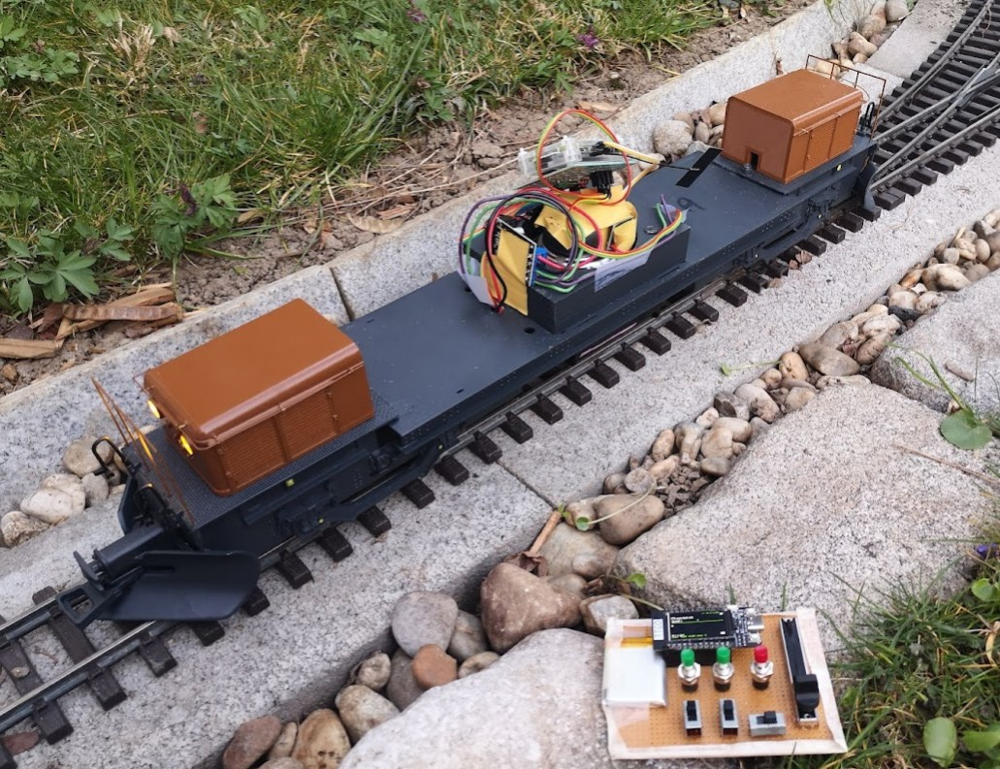

# btcontroll 

Modelleisenbahn übers Handy/Smartphone drahtlos steuern!
Entweder mit einem Raspberry Pi in der Lok selbst (das ist nur für die Gartenbahn interessant) oder über SRCPD und einen Booster eine DCC Lok ansterern. Bei Midp (die alten Nokias) verwende ich Bluetooth, für Android ist derzeit nur Wlan als Kommunikationsmedium eingebaut.

Diese Software ist meine private Spielerei, es sind jedoch alle herzlich willkommen den Code zu begutachten, auszuprobieren und Ideen beizutragen. Sollte allerdings irgendwas beschädigt werden ist jeder selbst schuld und ich lehne jegliche Verantwortung ab.

Project home: https://github.com/ferbar/btcontrol/

## bluetoothserver
Vermittlungsstelle Bluetooth/Wlan -> Hardware
Unterstütze Hardware:
* SRCPD (mit MERG - Booster)
* Raspberry PI PWM oder mit einer USB Platine

Siehe [bluetoothserver/](bluetoothserver/)

## control-android

Android App

siehe [control-android/](control-android/).
download [btcontrol.apk](../../raw/master/control-android/bin/btcontrol.apk)

## control-midp
Ein MIDP - java Programm welches aufs Handy (altes Nokia feature-phone) gehört

Siehe [readme](control-midp/README.md).
Die App ist unter /dist/btcontroll.jar

### midptestenv
Emulator um MIDP Programme am PC rennen zu lassen (zum Testen ganz nett, hat aber Bugs)

## control-esp32
Control Pad Hardware mit einem ESP32. siehe [control-esp32](control-esp32)

## ESP32 Lok - Elektronik
Für Akku Loks mit einem ESP32, siehe [esp32-server](esp32-server)

## ussp-push-0.11
ussp-push -> ussp-push-0.11/src/ussp-push
obex - push programm, programm um dateien über bluetooth an ein handy zu senden
ussp-push 00:11:22:33:44:55@ btcontrol.jar btcontrol.jar

