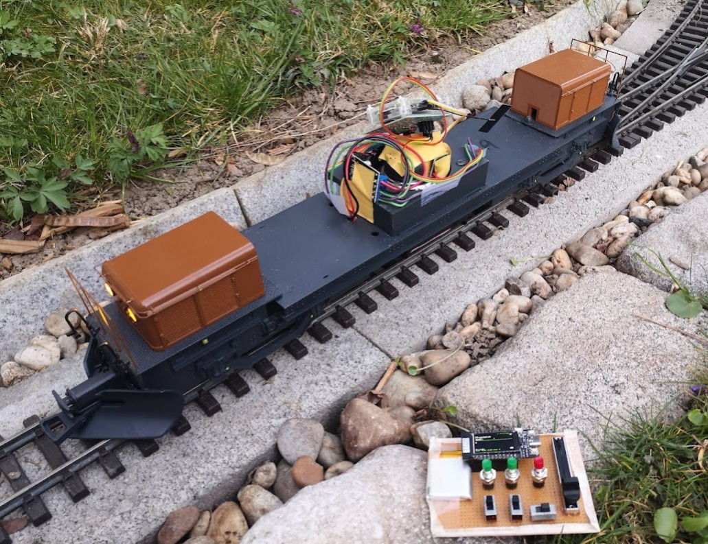
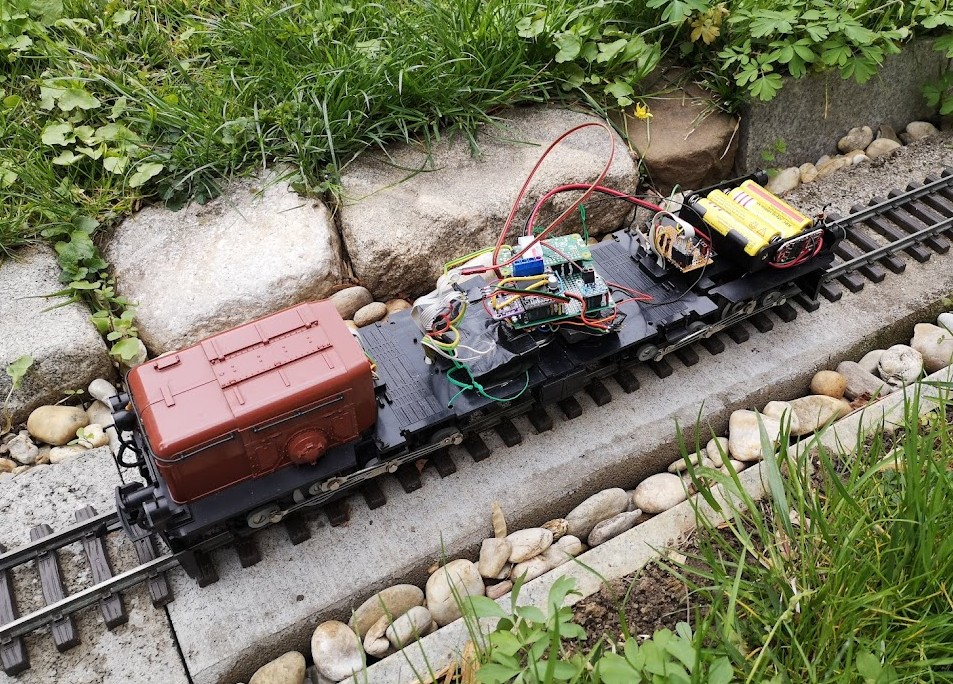

# Akku Lok

 

Handarbeit RhB 182 und LGB RhB Krokodil mit einem Raspberry Pi Zero-W umgebaut auf Akkubetrieb.

Das ist eine Anleitung um eine LGB Lok ohne Schienenstrom fahren lassen zu können. Als Hirn wird ein Raspberry Pi Zero - W verwendet, eine H Brücke am PWM Ausgang, ein MAX98357 I2S DAC + Verstärker (oder eine USB Soundkarte mit extra Verstärker) und ein paar FETs zum schalten der LEDs. Sollte ein Raspberry Pi Zero ohne W verwendet werden kann mit einem Bluetooth oder Wlan-Dongle gearbeitet werden.

## Partlist

| Anzahl | Bauteil | | |
| ------ | ------- | -- | -- |
| 1     | Raspberry Pi Zero W (Alt: A+) | Die Platine passt perfekt auf einen A+ natürlich kann man auch einen B+ nehmen.
| 1     | SD Karte	2GB oder mehr |
| ~~alt~~ | USB Wlan Dongle | Wlan im Raspberry Pi Zero W schon eingebaut!!!!<br>einer der unter Linux funktioniert (Linux Support steht bei vielen schon drauf!)<br>realtek chipsatz: Digitus 300N | DN-7042 | edimax N150 nano |<br>mediatek sind generell eher problematisch |
| ~~alt~~ | Bluetooth Dongle | ist im Zero-W schon eingebaut. ESP32 Control Pad geht nur mit Bluetooth 4.0 dongle. Empfehlung Class 1 (z.b. Hama)
| ~~optional~~ | usb soundkarte	| Vorzugsweise mit eingebautem Verstärker | neuhold |
| ~~optional~~ | Verstärker | PAM8406 (oder PAM8403) |
| 1 | optional MAX98357 I2S | NEU: I2S 'Soundkarte' hat einen Verstärker eingebaut, damit entfällt der PAM, wichtig: geht nur mit wiringPi. [Verkabelung + Setup](https://learn.adafruit.com/adafruit-max98357-i2s-class-d-mono-amp/raspberry-pi-wiring) |
| 1 | optional INA219 | NEU: I2C Strom/Spannungssensor |
| 4 | IRFML8244	| Mosfet Rds on 20 mohm für die LED Ausgänge | farnell |
| 7 | 1k R 1206	| SMD R	9335757 ??????? |
| 1 | Lochraster Platine |
| 1 | Buchsenleiste 20x2 | fürn Raspberry Pi - eventuell längere nehmen und kürzen | link |
| 1 | Buchsenleiste 3x1 | Motoranschluss,3* 2x1 für Beleuchtung | neuhold |
| 1 + X | Stiftleiste 3x1 | für Power Anschluss (Mitte=+) |
| 1 | Schalter        | zum ausschalten falls was schief gehen sollte |
| 1 | Polyswitch Sicherung 2,5A | 250 ... sicher ist sicher |
| 1 | Akku Pack	| Ikea Eneby ? |
| 1 | 5V Schaltregler | Recom 78e5.0 / HLK-K7805 / TR05S05 oder kleines 5V Schaltregler Board | neuhold rs-components |
| 1+1 | Stecker / Buchse zu den Akkus 4.2mm 5557/5559 Wire Cable Connector

### H - Brücke:

#### für 3A:
| Anzahl | Bauteil |    |    |
| ------ | ------- | -- | -- |
| 1 | L6203 | fixfertige H-Brücke | farnell oder im 5er Pack via eBay aus China (viel billiger)
| 3 | 22nF | Kondensator mit Haxen |
| 2 | 100nF | Kondensator mit Haxen |	
| 1 | 10-50 Ohm R | Widerstand mit Haxen ????? |

#### 30A (202204 keine boards verfügbar)

VNH5019a board

#### LiPo Akkus	
| Anzahl | Bauteil |    |    |
| ------ | ------- | -- | -- |
| 3-4 | LiPo Akku | Protected 18650 Battery | china shop |
| 1 | optional: LiPo protection board 3S / 4S | z.b. BM3451   TNDC-T20B, Tunen: Shunt ändern auf 0,25 Ohm damit der BMS früher wegen short abschaltet.<br>8254AAV (4,25V - 2,7V) schaltet bei 0,2V am Shunt ab. 0,05 Ohm Shunt -> schaltet bei 4A ab. Nachteil vom 8254: erwartet dass die Akkus über P geladent werden => wenn einmal unterspannung muss am Ausgang eine Spannung angelegt werden |
| 1 | 3S oder 4S Battery Holder | da gibts welche mit Federn - die sind länger und es passen auch die "Protected Batteries" rein |


## Hardware


## Setup Software Raspberry PI

Als Raspi Image hab ich DietPi verwendet: https://dietpi.com/downloads/images/DietPi_RPi-ARMv6-Bullseye.7z

### SD Karte in den PC

* DietPi Image auf eine SD-Karte kopieren (Linux: dd_rescue)

a) **NOCH IM PC** /boot mounten + /boot/dietpi.txt bearbeiten (wifi config)
https://dietpi.com/docs/usage/#how-to-do-an-automatic-base-installation-at-first-boot
```
AUTO_SETUP_ACCEPT_LICENSE=1
AUTO_SETUP_KEYBOARD_LAYOUT=de
AUTO_SETUP_TIMEZONE=Europe/Berlin
AUTO_SETUP_NET_WIFI_ENABLED=1
AUTO_SETUP_NET_WIFI_COUNTRY_CODE=DE
AUTO_SETUP_NET_HOSTNAME=raspi-99-6001
AUTO_SETUP_BOOT_WAIT_FOR_NETWORK=0

# optional
  AUTO_SETUP_SSH_PUBKEY=

CONFIG_CHECK_DIETPI_UPDATES=0
CONFIG_CHECK_APT_UPDATES=0

# das brauch ma fürs erste update -> nicht abdrehn
# CONFIG_NTP_MODE=0
CONFIG_ENABLE_IPV6=0
```
+ SSID + pass in dietpi-wifi.txt

b) mit etwas glück taucht der Raspi im netzwerk dank wlan auf. wenn nicht: mit usb - ethernet Adapter () booten (es gibt USB-Ethernet + 3 USB ports)

### DietPi konfigurieren
dietpi-config: (startet automatisch)
* wenn die uhrzeit nicht gesetzt werden konnte: NTP Mirror -> timeserver setzen
* Serial Console / UART -> aus, dort hängt das BT zeug dran
* Audio Options -> install alsa
  - bei I2S Sound "none" auswählen (max98357 gibts nicht) auswählen (sound config machen wir unten dann)
* Performance options
  - ondemand (throttle up: 80%, sample rate 300ms, initial turbo 30s)
* Advanced Options:
  - -swap space weg,- (manuell machen)
  - Time sync mode [boot only] <<< auf never tun???
  - bluetooth on
  - I2C on
* security options:
  - change hostname (sollte schon gesetzt sein)
* Network Options Adapters:
  - Wlan ein, key, country-code (sollte schon sein)
  - IPv6 off (sollte schon sein)
  - Wifi: Auto reconnect on
* Network Options Misc: Boot Net Wait: off

### Notwendige Pakete installieren

```
apt-get install git build-essential pkg-config libbluetooth-dev libasound2-dev \
libboost-all-dev avahi-daemon
```
mit pigpio (geht nicht mit I2S DAC)
```
yum install libpigpio-dev 
```

mit wiringPi (wiringPi muss von https://github.com/WiringPi/WiringPi mit git clone + build + build install installiert werden)

Für Entwicklung:
```
apt-get install vim less screen openssh-client lsof gdb pigpio-tools ODER raspi-gpio
```

### btcontroll installieren
```
mkdir -p /root/dev/
cd /root/dev/
git clone git@github.com:ferbar/btcontrol  oder mit https://
```

git pager deaktivieren
```
git config --global --replace-all core.pager ""
```

Kompilieren:
```
make
conf Verzeichnis anpassen
make install

./btserver
```

Die Handy / Android App sollte jetzt die Lok finden.

btcontrol.service:
requires network | bluetooth (!!!! nicht multiuser - wir brauchen keine ntpd zeit !!!!)
```
systemctl enable btcontrol
systemctl enable btcontrol-initbt
```

### DietPi für Akku optimieren (readonly filesystem)

```
dietpi-services
  cron -> inactive + mask (202304: ok)
-systemctl disable cron-

rm -rf /var/lib/dhcp /var/lib/misc
ln -s /run/ /var/lib/dhcp
ln -s /run /var/lib/run
ln -s /run /var/lib/misc
rm /etc/resolv.conf && ln -s /run/resolv.conf /etc/
mv /var/tmp/ /var/tmp-org/ && ln -s /tmp /var/tmp
```
vi /etc/bash.bashrc
```
# set variable identifying the filesystem you work in (used in the prompt below)
set_bash_prompt(){
    fs_mode=$(mount | sed -n -e "s/^\/dev\/.* on \/ .*(\(r[w|o]\).*/\1/p")
    PS1='\[\033[01;32m\]\u@\h${fs_mode:+($fs_mode)}\[\033[00m\]:\[\033[01;34m\]\w\[\033[00m\]\$ '
}

# ab 2025:
alias ro='sudo mount -o remount,ro / ; sudo mount -o remount,ro /boot/firmware'
alias rw='sudo mount -o remount,rw / ; sudo mount -o remount,rw /boot/firmware'

# alt
alias ro='sudo mount -o remount,ro / ; sudo mount -o remount,ro /boot'
alias rw='sudo mount -o remount,rw / ; sudo mount -o remount,rw /boot'

# setup fancy prompt"
PROMPT_COMMAND=set_bash_prompt
```
Siehe: https://hallard.me/raspberry-pi-read-only/


Anpassungen /lib/systemd/system/systemd-timesyncd.service
```
#PrivateTmp=yes
StateDirectory=run/timesync
```

```
dietpi-drive_manager
```
root und /boot readonly mounten
202203: / ro hat nach einem reboot funktioniert, wenn nicht siehe unten fstab.

Wlan ist nicht schneller _up_ wenn /boot nicht gemountet wird. Problem: die dietpi scripts gehen dann nicht mehr,
bluetooth wird zu früh initialisiert, kein ntp etc... Nur Probleme!
```
reboot
# jetzt sollte der prompt grün sein und (ro) da stehn
rw    # -> disk rw mounten
vi /etc/fstab
```
mit 0 am Ende von / und /boot den fsck on boot disablen

fsck on boot raus aus der config / cmdline.txt => notwendig?


### boot delay auf 0 setzen (default ist 1, viel kanns nicht bringen, von der sd karte abhängig)
```
vi /boot/config.txt
boot_delay=0 fsck.mode=skip
```
fastboot raus

das sollte mit fstab -> '0' nicht notwendig sein
```
 vi /boot/cmdline.txt
fsck.repair=yes auf fsck.repair=no
```

### vim config tunen (mouse aus)
vi /etc/vim/vimrc.local
```
" Explicitly source defaults.vim so you can override its settings
source $VIMRUNTIME/defaults.vim
" Prevent it from being loaded again later if the user doesn't have
" a vimrc
let skip_defaults_vim = 1
" Disable the settings you don't like
set mouse=
```


```
systemctl mask systemd-rfkill.service
```

wird bei schlechtem empfang mehr ärger machen als es bringt => wifi soft AP weiter unten
```
systemctl disable dietpi-wifi-monitor.service
```

Kopiert logs von /var/tmp nach /var/log ... brauchen wir nicht
```
systemctl disable dietpi-ramlog.service
```

### sound config
#### sound config für I2S
das meiste macht schon dietPi. 
  * /etc/asound.conf von https://learn.adafruit.com/adafruit-max98357-i2s-class-d-mono-amp/raspberry-pi-usage
  * `vi /boot/firmware/config.txt`<br>
    `dtoverlay=max98357a`
  * eventuell checken ob die raspi onboard module geladen werden
  * rebooten, sound abspielen mit aplay ERST DANN mit alsamixer checken
  * gpio mode 27 out ; gpio write 27 1 ; aplay /usr/share/sounds/alsa/Front_Center.wav

#### USB Soundkarte
usb soundkarte wird standardmässig nicht als default genommen
Fehlermeldung:
aplay: set_params:1339: Sample format non available

aplay --dump-hw-params <wavfile>
cat /etc/asound.conf 
defaults.pcm.card 1
defaults.ctl.card 1

## camera config
202203: schon done
/etc/modprobe.d/dietpi-disable_rpi_camera.conf
dietpi-disable_rpi_camera.conf   => blacklist bcm2835_isp

## hdmi output abdrehen
!!!!!!!!!!!!!!!!!!!!!!! TODO !!!!!!!!!!!!!!!!!!!!!!!!!!!!!!!!!
=> hdmi-off.service >>>>>>>>>>>>>>>>>>>>>>>>> ins make install tun


```ln -s /run/ /var/lib/bluetooth```


202203: ist weg
-mappt /boot/dietpi ins ram => wozu-
``` systemctl disable vmtouch```

## bluetooth am Raspberry PI Zero

Der Bluetooth chip hängt am TX0 und RX0
mit dietpi-config -> Advanced Options -> Serial/UART -> ttyAMA0 console Off
```
# scheint notwendig zu sein:
apt-get install pi-bluetooth
```

## remove ms repo, don't need on raspi-lok. (installed by raspi-sys-something repo) 202203: ist schon weg
mv /etc/apt/sources.list.d/vscode.list /etc/apt/sources.list.d/vscode.list.disabled

## Setup Wlan soft - AP
**Wichtig** Umbedingt Tastatur und HDMI Capture Card / Bildschirm organisieren
### timesync abdrehen
* dietpi-config -> Advances -> Time sync mode: Custom

### mit dietpi-gui 2025: NICHT SO MACHEN!!!!
**Hint:** das hat noch nie ohne probleme hingehaut weil der schon vorm installieren der Pakete das wlan abdreht ...
die default IP ist IP 192.168.0.100 (wenns nicht geändert wurde)
control-android: JmDNSImpl.java braucht einen patch wenn der isc-dhcp-server verwendet wird (siehe control-android/README.md)

manuell vorher:
WLAN0 IP Adresse auf 192.168.0.1 ändern (.1 findet man eher)

```
apt-get install -y hostapd isc-dhcp-server lighttpd screen
# vi /etc/dhcp/dhcpd.conf
...
subnet 192.168.0.0 netmask 255.255.255.0 {
  range 192.168.0.10 192.168.0.19;
  option routers rtr-239-0-1.example.org, rtr-239-0-2.example.org;
}
...
```

**WICHTIG:** dietpi-config im screen starten!


hostapd.conf checken: (202507 hat das dietpi das wpa nicht eingeschalten
```
wpa=2
wpa_passphrase=YourPassPhraseHere
wpa_key_mgmt=WPA-PSK
wpa_pairwise=TKIP CCMP
rsn_pairwise=CCMP
```


### halbautomatisiert (2025: SO MACHEN)
genaue Beschreibung (NICHT machen) : https://blog.thewalr.us/2017/09/26/raspberry-pi-zero-w-simultaneous-ap-and-managed-mode-wifi/

```
apt-get install -y hostapd dnsmasq lighttpd
# hostap + udev + dnsmasq + lighttp config anlegen:
cd btcontrol/bluetoothserver
make install
```
Hostapd Passwort (bzw in der /etc/hostapd/hostapd.conf anpassen)
```########### setting hostapd config ###########
hostap config: ssid: raspi-11 wpa_passphrase=**btcontrol**
```

Beispiel /etc/network/interfaces
```
# Drop-in configs
source interfaces.d/*

# Ethernet
wurschtjetzt

# WiFi
#allow-hotplug wlan0  << startet das client wlan, führt aber zu hacklern, kann dann händisch mit ifup wlan0 gestartet werden
iface wlan0 inet dhcp
        wpa-ssid "ssid-wo-wir-client-sein-wollen
        wpa-psk wifipassword
pre-up iw dev wlan0 set power_save off
post-down iw dev "wlan0 set power_save on

up .... iptables RAUS WENNS NICHT GEBRAUCHT!!!
...
```

/etc/dnsmasq.conf << dort alles rauskommentieren, die config landet unter /etc/dnsmasq.d/
```
+ address=/#/192.168.10.1
```

macht das make install schon hostapd.conf: (channel kann irgendwas sein, nimmt den vom verbundenen wlan)
```
+ multicast_to_unicast=1
```

macht das make install schon  lighttpd:

/etc/lighttpd/conf-enabled/redirect.conf
```
   $HTTP["host"] != "raspi-lok" {
        url.redirect = ("" => "http://raspi-lok/")
    }
```

#### brauch ma nicht
- /sbin/iw phy phy0 interface add ap0 type __ap ; /bin/ip link set ap0 address b8:27:eb:0b:78:f2 ; 
- /bin/ip link set ap0 up; systemctl restart hostapd ; systemctl restart dnsmasq-

dietpi-services
=> hostap + dnsmasq systemd controlled machen, exclude from service restart

### serial0 abdrehen? => verhindert cpu throttle / stromsparen
	

### Stromsensor - INA219 testen

```
echo ina219 0x40 > /sys/bus/i2c/devices/i2c-1/new_device
watch cat /sys/bus/i2c/devices/i2c-1/1-0040/hwmon/hwmon2/in1_input
```
Current Sensor: Die breakout Boards haben einen 0,1 Ohm shunt, default mässig geht das Kernel Modul von 0,01 Ohm aus, daher müssen wir den Shunt anpassen:
```
echo 100000 > /sys/bus/i2c/devices/i2c-1/1-0040/hwmon/hwmon2/shunt_resistor
watch cat /sys/bus/i2c/devices/i2c-1/1-0040/hwmon/hwmon2/curr1_input
```
	
Shunt resistance(uOhm)

## Altes Setup mit Raspbian
allgemeine Probleme:

* Uhrzeit falsch:
```
ntpd -gq
```
hint: raspberry pi3 + wlan + ntp hat einen Bug, siehe google suche nach TOS flag

* Bluetooth funktioniert nicht:

bluez 5 hat neues Interface um ein Service zu registrieren, siehe lib/systemd/system/bluetooth.service

### VERALTET (in der Zwischenzeit gibt's eine lite Version) raspbian aufräumen:
 
```
 apt-get remove --purge wolfram-engine triggerhappy anacron logrotate dphys-swapfile xserver-common lightdm x11-utils xinit x11-xkb-utils xdg-utils x11-common \
 libreoffice libreoffice-core libreoffice-common \
 nodered supercollider freepats omxplayer scratch \
 oracle-java8-jdk bluej greenfoot \
 lxde-common lxde-icon-theme lxterminal lxpanel-data \
 libx11-6 libgtk-3-0 libgtk2.0-0 gtk2-engines leafpad gpicview galculator xarchiver alacarte \
 fonts-dejavu-extra fonts-sil-gentium-basic
 liblapack3 libv8-3.14.5 nodejs python3.4-minimal libpython3.4-stdlib pypy
 libgstreamer1.0-0 libgl1-mesa-glx libgles1-mesa libgles2-mesa libglapi-mesa
 plymouth

 apt-get autoremove --purge

 apt-get install vim
 update-alternatives --config editor
```

raspian kernel module kompilieren (wlan z.b.)
```
apt-get install raspberrypi-kernel-headers
```

die sdkarte kann mit dd_rescue kopiert werden und mit parted <loopdevice> bearbeitet werden. mit kpartx müssen die partitionen vorher angelegt werden.

### Dateisystem readonly
UPDATE: https://hallard.me/raspberry-pi-read-only/

warum? damit man ohne schlechtes Gewissen den Stecker ziehen kann. Vorallem die boot Partition (FAT) kann leicht beleidigt werden. (dass man dann erst nach mount -o remount,rw / und /boot was änern kann versteht sich von selbst)

```
 update-rc.d rsyslog disable
 sudo vi /etc/fstab
   options: defaults,ro
   tmpfs nach /tmp mounten
```

wenn man das nicht machen will und es reicht einem nach dem ersten superblock time is in future: /etc/e2fsck.conf und broken_system_clock reinschreiben. Siehe:
http://unix.stackexchange.com/questions/8409/how-can-i-avoid-run-fsck-manually-messages-while-allowing-experimenting-with-s

### Hostname ändern
/etc/hosts und /ets/hostname anpassen

dhcp & avahi übernimmt den hostname

bluetooth [4.99] speichert unter /var/lib/bluetooth/<mac>/config den hostname. Kann dort und per 
 dbus-send --print-reply --system --dest=org.bluez /org/bluez/$(pidof bluetoothd)/hci0 org.bluez.Adapter.SetProperty string:'Name' variant:string:'<neuer name>'
geändert werden

### Disable Raspberry PI BCM soundcard
* /etc/modules checken ob snd-bcm2835 geladen wird
* /etc/modprobe.d/alsa-blacklist.conf
```
# disable bcm soundcard
blacklist snd_bcm2835
```
/etc/modprobe.d/snd* : Zeile raus damit die USB soundcard card=0 wird
```
# Keep snd-usb-audio from beeing loaded as first soundcard
#options snd-usb-audio index=-2
```

### Abschluss

```
rw
systemctl enable btcontrol
umount /boot
fsck /dev/mmcblk0p1
reboot
```
