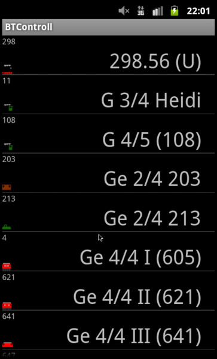

# Eclipse Projekt - btcontrol Android Steuerung




# JmDNS installieren:
im extern Verzeichnis ein git clone https://github.com/jmdns/jmdns.git
commit ID: dd8985fdffe5395a40fb554bf750287140b86cb7

2025:

wird ein RaspberryPi mit isc-dhcp-server (statt dnsmasq) verwendet muss folgende Änderung in src/main/java/javax/jmdns/impl/JmDNSImpl.java gemacht werden:
```
private void openMulticastSocket(HostInfo hostInfo) throws IOException {

+        // _socket.joinGroup(_group);
+        // [chris] workaround 20250731
+        _socket.joinGroup(new InetSocketAddress("224.0.0.251", 53), hostInfo.getInterface());

```

damit hat das Verbinden um Raspi funktioniert

https://github.com/twitwi/AndroidDnssdDemo/tree/master/AndroidDnssdDiscoveryEclipse
[da gibts noch kein git dafür]
http://svn.code.sf.net/p/jmdns/code/trunk/src/main/java/javax

# Kompilieren

btcontrol -> Properties -> Android -> Project Build Target auf 15 (2025: auf min 23) setzen

damit die BuildVersion gesetzt wird: btcontrol -> rechte Maustaste -> Properties -> Builders -> New ...

# Bedienung

Power Button: Strom aus command senden

Back / Home Button: gesteuerte Lok stop

Lautstärke + / - => Beschleunigen / Bremsen

