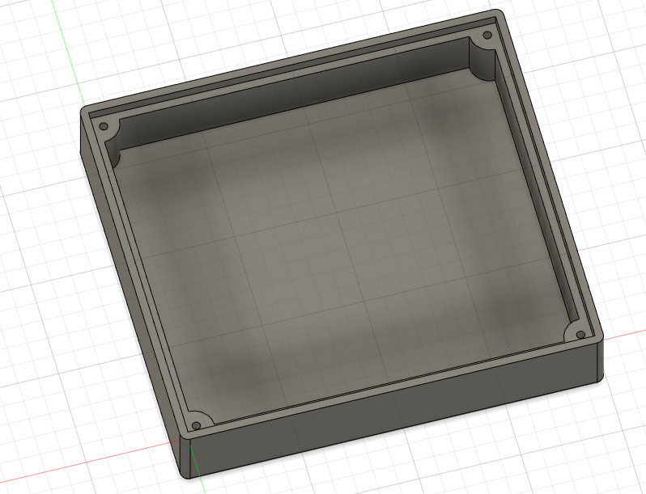

# ESP32 Control Pad


Wlan / Bluetooth Steuerung für die Eisenbahn mit haptischem Feedback. Wlan / Lok Auswahl übers Display, Geschwindigkeit und Funktionen über das Schiebepotentiometer bzw die Taster.

202203: die ESP32 Bluetooth lib braucht leider extrem viel RAM/Flash, funktioniert auch nicht mit Blueooth 2.0 USB Dongles, braucht mein gepatchtes ESP32-Arduino-SDK

## Partlist

* Lilygo ESP32 T-Display
* Schiebepotentiometer 60mm - 70mm Gehäuse, 45mm Schiebeweg, linear (B10K -> SC4521N)
* Stiftleiste (eventuell beim ESP32 dabei)
* Ein paar Taster (3 für mein .svg)
* Ein paar Schalter (3 für mein .svg)
* Lochrasterplatine oder gefräste Plexiglas Front
* Akku mit passendem Stecker für das T-Display (JST-PH 1,25mm), oder 14500 AA Lipo Akku + Bat halter
* Visual Studio Code + USB C Kabel

## Plexiglas Frontplatte

* Plexiglas 100mm x 90mm
* CNC Fräse ;-)
* 1mm Fräser + 1,5mm Fräser
* 3 Taster
* 3 Schalter
* Power Schiebeschalter
* bCNC
* 2 abgezwickte Schrauben für die TTGO - Display - Taster - 2,8mm Durchmesser, 6mm lang ohne Gewinde, Ende abgeschliffen
* 3 Messing Nagerl zum Befestigen vom TTGO - Display

### howto bCNC
mit >= python3.8
pip3 install bCNC

Control-Pad-plexiglas-löcher-zu-klein.ngc !!! fixme: checken !!

### howto ngc Datei im bCNC
'Case - front - with border - taster 6.7mm switch 6mm.svg' importieren

CAM -> EndMill Durchmesser checken (1,5mm)
CAM -> Material: Feed 40, Plunge Feed 20 depth Increment 0.5
Probe -> Tool -> "Manual Tool Change" Policy: "Manual Tool Change (NoProbe)" Change: -10.0 -10.0 **MZ: 25**  <<<< das ist MPOS und nicht WPOS !!!!
checken ob die pos erreichbar ist ( keinen endkontakt erreicht)

die 3 positionierungs Kastel löschen

alle Löcher auswählen die durchgebohrt werden sollen (2 Taster + 3 Taster + 3 Schalter + 3 Schiebepoti)

**bug 2025:** offset für die löcher muss a) für jedes loch einzeln gemacht werden b) es müssen im editor alle neuen Pocket blöcke bis auf den ersten abgehackt werden

**Wichtig: wo gehört das dazu???*** die materialstärke besser auf +0.5mm dazu setzen, dann muss das werkstück nicht 100% plan liegen und die löcher sind trozdem komplett durchgebohrt
Offset -> End Mill 1.5mm auswählen

mit Tool: Rooler kann man checken dass der Durchmesser der Löcher jetzt um 1,5 kleiner ist

Cut -> Target Depth: -3 (die Dicke der Frontplatte) (ramp, ramplenght. 2)

bei Editor checken ob die gefrästen Löcher auch nur einmal gemacht werden und nicht 6*

die Schalterkerben auswählen die nur oberflächlich gefräst werden sollen (3)

Offset -> End Mill 1mm

siehe bug oben!!!

Cut -> Target Depth -1.0

die Display Löcher auswählen (3)

Drill -> Target Depth -1.0

die Sachen mit dem 1mm Bit umpositionieren im Editor (move down)

Add block "tool change" command: M6

https://github.com/vlachoudis/bCNC/wiki/Tutorials:-Tool-Change-with-bCNC,-FreeCAD-&-grbl


fürs einspannen einen 13mm und 18mm schraubenschlüssel herrichten, ein dünnes holzrestl um den fräser wieder sauber zu krigen schadet auch nicht

**VORSICHT** fräser kann einen plexiglas klumpen machen welcher auf dem Fräser picken bleibt
wassertropfen mit einer spritze hin tun, ein 3mm dicken holzrest zum putzen bereit halten

**FIXME** die kerben für die schalter 3,5mm breit


## 3D Print Boden


* 4* 1,6x8 versenk Schrauben

howto: TODO **************************

## Kompilieren

getestet mit platformio/framework-arduinoespressif32@^3.20007.0

### esp32 Arduino SDK kompilieren

Optional: das IDF wird im Arduino SDK mit komplett aktivierten BT + BLE + A2DP + HFP kompiliert was extrem viel RAM + Flash benötigt. Images können sonst über eine BT Verbindung nicht angezeigt werden.

Arduino sdk ohne A2DP und BLE selber kompilieren -> spart 300kB flash und 50kB ram:

* git clone esp32-idf -> IDF 4.4.4 branch
* git clone https://github.com/espressif/esp32-arduino-lib-builder.git -> IDF 4.4 branch + setup + git submodule init
* git clone arduino-esp32 -> irgendeinen release branch welcher IDF 4.4.4 verwendet
* unter components/arduino softlink auf arduino-esp32 anlegen
* die ./arduino-lib-builder/defaultconf.esp32 nach esp32-arduino-lib-builder/configs/ verlinken
* Build reduzieren: in configs/builds.json unter "target": "esp32" nur "bootloaders":[ ["dio","40m"] ] über lassen, "mem_variants":[ ["dio","80m"] ]
* die ./arduino-lib-builder/build-chris.sh nach esp32-arduino-lib-builder/ verlinken
* build-chris.sh im esp32-arduino-lib-builder/ aufrufen, kopiert die object files nach .platformio/packages/framework-arduinoespressif32
* tools/sdk/esp32/sdkconfig checken ob BLE abgedreht ist (CONFIG_BTDM_CTRL_MODE_BR_EDR_ONLY=y)


### ESP32 Create Memory map file
-https://everythingesp.com/esp32-arduino-creating-a-memory-map-file/-

mit platformio gibts unter .pio/build/wemos_d1_mini32/firmware.map immer ein .map file

Analyse z.b. mit fpvgcc --sar .pio/build/wemos_d1_mini32/firmware.map

Zeigt Grösse von Funktionen und statischen Variablen an:

memstat.sh

### Call-graphs: (von wo wird welche funktion aufgerufen)

Anleitung für radare2: https://reverseengineering.stackexchange.com/questions/16081/how-to-generate-the-call-graph-of-a-binary-file

Übern Browser:

´``
r2 -c=H .pio/build/wemos_d1_mini32/firmware.elf
```


Auf der Konsole:
```
afl | grep BTAddress
s 0x400eb128
agf
```

output.dot mit less anschaun und nach funktionsname suchen, dann nach `-> "func-adresse"` dann sieht man wo die funktion aufgerufen wurde.

xdot.py ist nur bedingt hilfreich

## Hardware:

5V Stromanschulss: keine Strom-Rund Buchse montieren, GND -> GND, +5V -> 1Ohm R -> Kondensator am TTGO-T-Display Board (siehe Bild)

## Workarounds

### ttgo-display-esp32 startet nach power on nicht
=> Kondensator entfernen (bei neueren Versionen vom Board nicht mehr notwendig, dort fehlt der C schon)


