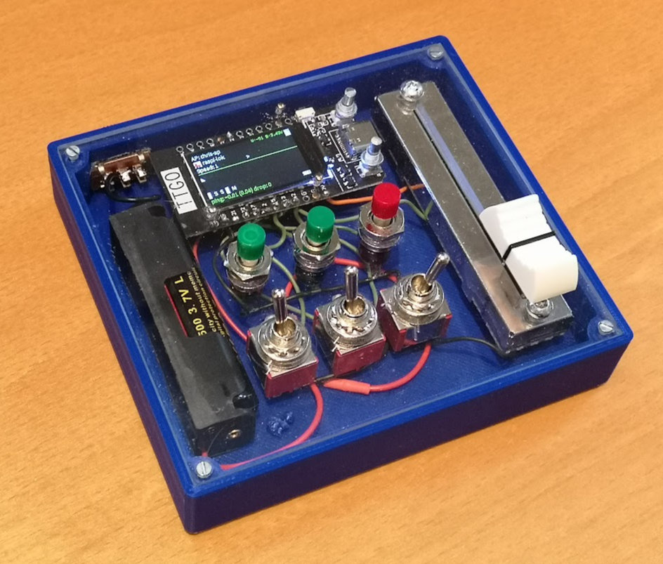

# ESP32 Control Pad

Wlan / Bluetooth Steuerung für die Eisenbahn mit haptischem Feedback. Wlan / Lok Auswahl übers Display, Geschwindigkeit und Funktionen über das Schiebepotentiometer bzw die Taster.

202203: die ESP32 Bluetooth lib braucht leider extrem viel RAM/Flash, funktioniert auch nicht mit Blueooth 2.0 USB Dongles, braucht mein gepatchtes ESP32-Arduino-SDK

## Partlist

* Lilygo ESP32 T-Display
* Schiebepotentiometer 60mm - 70mm Gehäuse, 45mm Schiebeweg, linear (B10K -> SC4521N)
* Stiftleiste (eventuell beim ESP32 dabei)
* Ein paar Taster (3 für mein .svg)
* Ein paar Schalter (3 für mein .svg)
* Lochrasterplatine oder gefräste Plexiglas Front
* Akku mit passendem Stecker für das T-Display (JST-PH 1,25mm), oder 18650 Akku
* Visual Studio Code + USB C Kabel

## Plexiglas Frontplatte

* Plexiglas 100mm x 90mm
* CNC Fräse ;-)
* 1mm Fräser + 1,5mm Fräser
* 3 Taster
* 3 Schalter
* Power Schiebeschalter
* bCNC
* 2 abgezwickte Schrauben für die TTGO - Display - Taster - 2,8mm Durchmesser, 6mm lang ohne Gewinde, Ende abgeschliffen
* 3 Messing Nagerl zum Befestigen vom TTGO - Display

howto bCNC: TODO **************************

## ESP32 Create Memory map file
https://everythingesp.com/esp32-arduino-creating-a-memory-map-file/

## Workarounds

### ttgo-display-esp32 startet nach power on nicht
=> Kondensator entfernen

