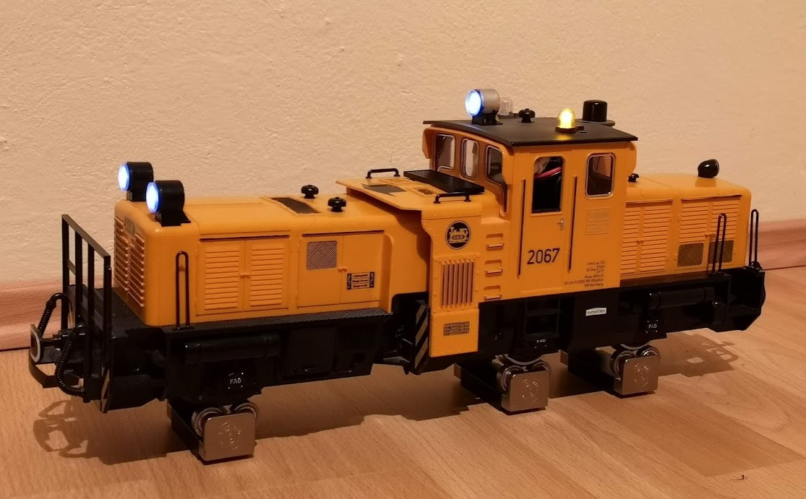
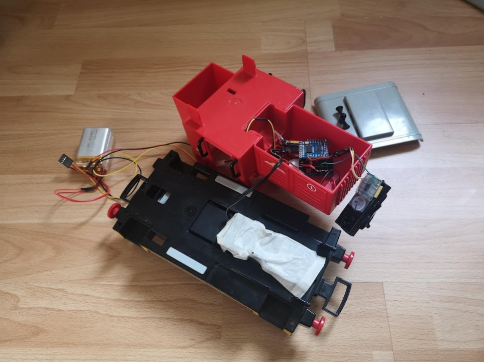

# Akku Lok Steuerung / Elektronik mit ESP32

## LGB Putzlok

LGB Putzlok mit Ikea Akkus und ESP32 (ESPDuino und Dual-VNH5019 Motor Shield9 als Elektronik

Beschreibung: [LGB Putzlok](Setup-Putzlok.md)

## Playmobil Lok
[Playmobil Lok](Setup-Playmobillok.md)

