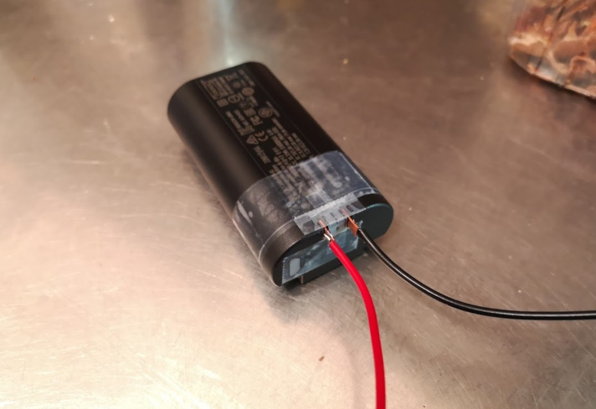
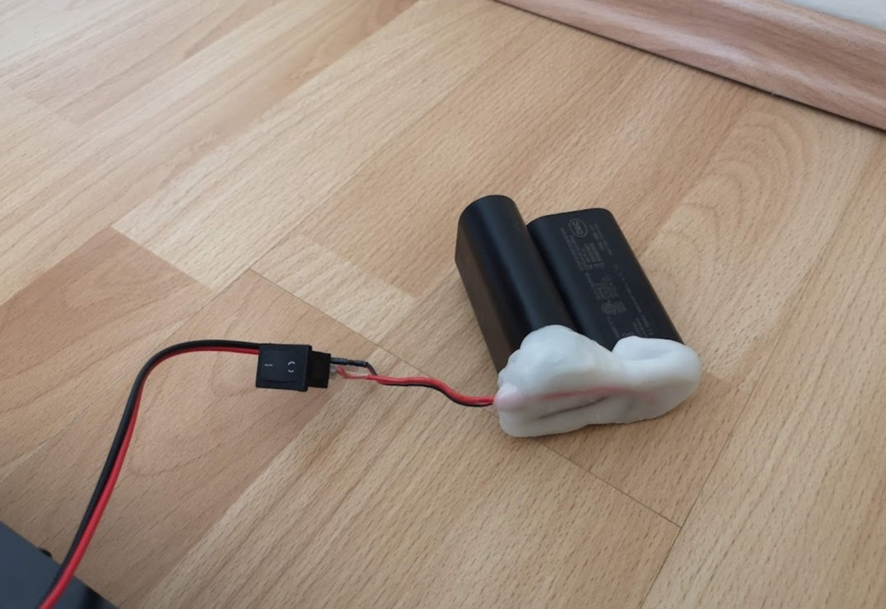
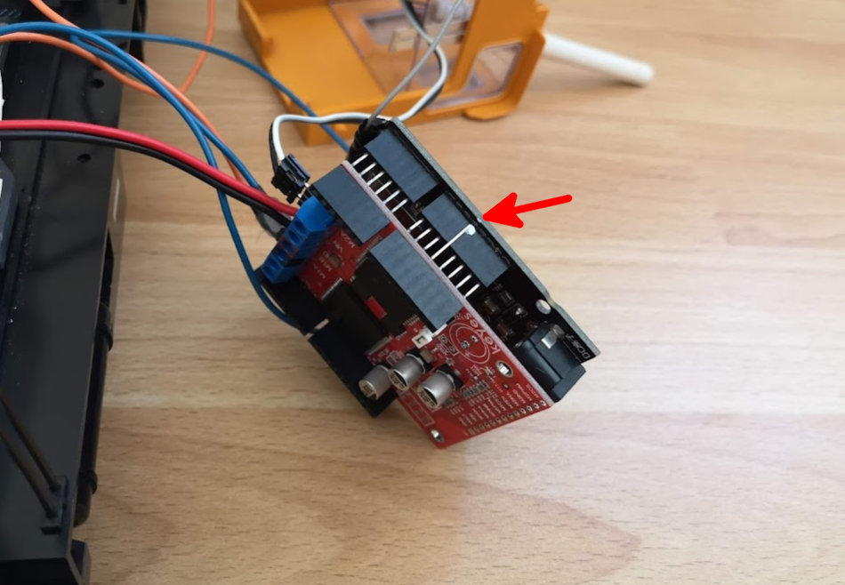
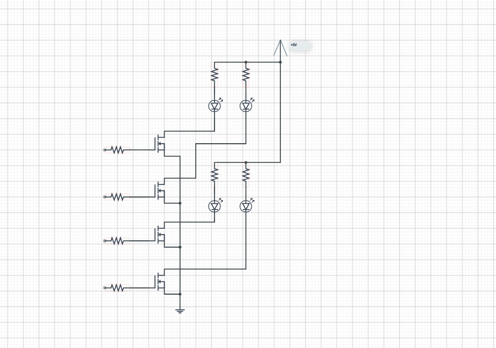
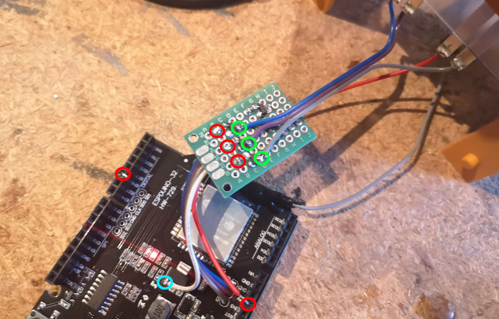
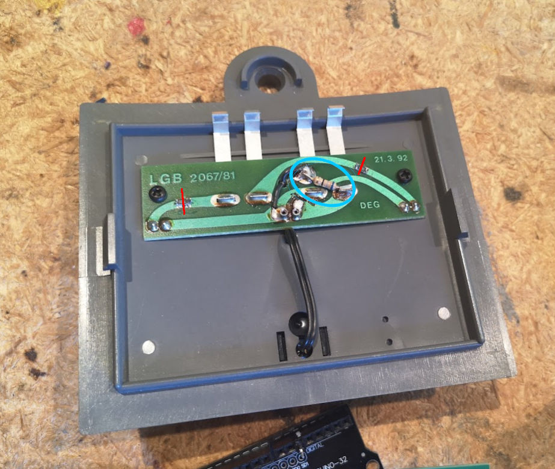
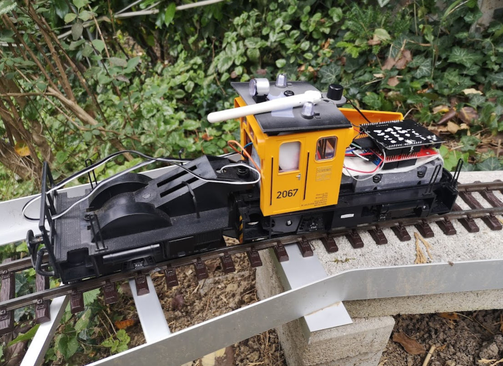

# Setup Putzlok

Kurze Docu zum Umbau einer LGB Putzlok in eine Akku Lok mit einem ESP32

## Partlist

* Die LGB Putzlok ;-)
* ESPDuino -> ESP32 Board in Arduino - Form - auf Aliexpress nach "ESP32 R32" suchen.
* VNH5019 Motor Shield
* 2* Ikea Braunit Akku Packs
* Pins für die Akkus (aliexpress: https://de.aliexpress.com/item/4000332107587.html?spm=a2g0s.9042311.0.0.27424c4dFLLeEG 10 Pairs Pitch 2.5 mm 4 Positions Female Blade Receptacle 5.8 mm Male Header Battery Connector Right Angle Through Holes 7A /pin)
* Polymorph Plastik kugerln
* Kleinzeug für die Beleuchtung
  * Lochrasterplatine
  * FETs (z.B. irfml8244)
  * Widerstände (smd 100Ohm, 150 Ohm für die gelben LEDs, 75Ohm für die Weissen LEDs)
  * 2 gelbe 5mm LEDs: Warnlichter fürs Dach, rundstrahlend oder diffus z.b. von led1.de. Wenn keine verfügbar kann auch mit einem Drehmel ein Loch in die Linse gefräst werden.
  * 4 Weisse als Scheinwerfer (3mm)

## Zusammenbau

### Vorbereitungen Arduino + ESP32 Libs + config

Siehe: [btcontrol/btcontrol.ino](btcontrol/btcontrol.ino)

### Lokführer

Sry, der muss raus, kein Platz mehr für den Kollegen.

### Akkus

Die 2 Akkus müssen in Serie geschalten werden damit wir 14V - 16V bekommen. Kabel (optional mit Schalter) anlöten, auf die Polung achten, und dann kommt die Patzerei:
Stecker in die Akkus, obern Teil, dort wo der Stecker von den Akkus ist mit Klebeband abkleben (eventuell mit Vaseline noch einfetten???).

Das Polymorph Plastik mit kochendem Wasser erhitzen und drauf patzen damit der Stecker nicht mehr rausfallen kann.
10 Minuten warten, die Akkus werden etwas mühsamer rausgehen da das Polymorph Plastik etwas geschrumpft ist.

### ESP32 + Motor Shield

Software übers Android Studio einspielen, eh klar. Zusammenstecken ist soweit auch klar. Aber wichtig: vom Motor Shield den +5V pin *NICHT* einstecken!!! Es funktioniert sonst das WLAN so gut wie nicht !!!

Optional: grössere WLAN Antenne anlöten (fummelig)

### Pinbelegung

Für das Motor Shield:

* VOUT => Schaltregler am ESPDuino Board

#### BridgeA
* IO26 -> M1INA
* IO17 -> M1INB
* IO27 -> M1ENA/B (Vorsicht: pull up auf 5V)
* IO13 -> M1PWM
* IO02 [ADC2_2] -> M1CS

#### BridgeB
* IO14 -> M2INA
* IO12 -> M2INB
* IO19 -> M2ENA/B (Vorsicht: pull up auf 5V)
* IO05 -> M2PWM
* IO04 [ADC2_0]-> M2CS

#### Freie Pins (für LEDs z.b.)
* IO03 RX0
* IO01 TX0
* IO25 DAC1
* IO16 RX2 -> Scheinwerfer hinten
* IO23 
* IO18 
* IO35 ADC1_7
* IO34 ADC1_6
* IO36 ADC1_0
* IO39 ADC1_3

3 Pin Header
* IO15 -> Scheinwerfer vorne
* IO33 -> Warnlicht1
* IO32 -> Warnlicht2

6 Pin Header:
N/A, nur Flash ROM Pins

### Beleuchtung

Nachdem wir mit Akkus fahren und LEDs nur ein Zehntel an Energie brauchen gegenüber einer Glühbirne würde ich alle Lämpchen gegen LEDs tauschen. Gelbe LEDs können wir direkt an den ESP32 hängen, aber für die Weissen brauchen wir auf jeden fall einen kleinen Verstärker:

Zuerst auf einer Lochrasterplatine (ich bevorzuge die durchkontaktieren) die Locher verzinnen, dann Rs + FETs mit einem kleinen Schraubenzieher fixieren und anlöten. Drei der Eingänge werden an den 3 Pin Header angelötet, #4 an einem Pin den wir in IO16 stecken, +5V ebenfalls mit Pin in +5V.

Einen großen Schrumpfschlauch drüber und die Kabel, optional mit Dupont Stecker verlöten

Widerstände im Führerhaus Dach:
* für die gelben LEDs 150 Ohm (bedrahtet oder SMD)
* für die Weisse LED 68 Ohm, Drähte 15mm lang lassen

An den eingezeichneten Stellen die Leiterbahnen durchtrennen und die 150 Ohm R für die gelben LEDs einbauen, für die Weisse der 68 Ohm R.

Bei den LEDs natürlich immer auf die Polung achten. *Hint:* der grosse Topf in der LED ist Minus. 

### Ergebnis

### Offen
* haben die Ikea Akkus einen Tiefentladeschutz?
* Akkuladestand messen, an die Fernsteuerung melden, Startgeschwindigkeit abhängig von der Akkuspannung
