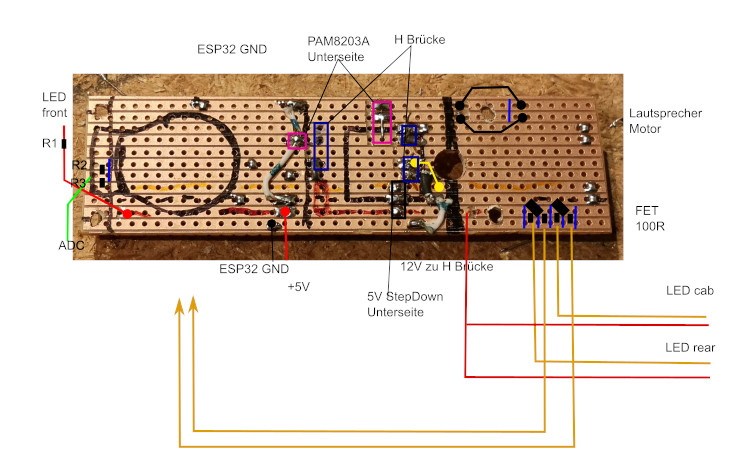

## Umbau einer LGB Stainz zur Akkulok

### Partlist:
* esp32 cam
* kleine Antenne mit Antennenstecker (optional)
* drv8871 H brücke board
* pam 8302A board (+diode + 100µF tantal)
* stepdown 5V
* polyswitch fuse 1A
* Ein/Aus Schalter
* streifen leiterplatine - abmessungen siehe sketch
* Licht hinten + Führerhaus: 2* FET + 4* 100Ohm + 2* LEDs
* Licht vorne LED + 100Ohm
* 4* 14500 protected lipo akku (hab genommen 900mAh von trustfire)
* 1* AA Bat Halter
* optional kabel stecker

### esp32 cam vorbereiten
   1. flashen
   2. plastik von den pinleisten runterziehen und pins einzeln rauslöten -> power + rx + tx + gpio0 + gnd daneben eventuell noch drauf lassen
   3. flash led runterlöten / rauskratzen
   4. antennen R umlöten (wenn externe Antenne)
   5. Antennenkabel kürzen für weniger Kabelsalat

### Stainz zerlegen
   http://atw.huebsch.at/Modell/G-Spur/LGB_Stainz.htm https://www.gartenbahnprofi.de/16101/GB_0123_Demontage_Stainz.pdf (ich würde keinen Schraubendreher zum Raushebeln verwenden da man sonst Kratzer verursacht, besser irgendwas aus Plastik nehmen, z.b. zur Handy Reparatur)

### Platine löten
* platine schneiden + bohrungen machen + leiterbahnen unterbrechen

* schaltregler auf der unterseite drauflöten
   checken ob die 5V dort sind wo sie hingehören

* pam auf der unterseite drauflöten

* bridge: drahtln in die base platine löten (nicht das h brücke board)

* esp32: nur + und gnd anlöten, verbindung zur bridge, motor testen, verbindung zum pam

* Lautsprecher im Führerstand: kleiner Schiebeschalter, dort kann auch gleich eine polyswitch fuse montiert werden

LEDs:
GPIO 0  LED Führerstand
GPIO 4  LED vorn
GPIO 16 LED hinten
GPIO 33 esp32 cam onboard led

ADC:
GPIO 35

### Lautsprecher
Meine Stainz hatte schon einen Lautsprecher im Führerstand eingebaut mit einer simplen Platine. Lautsprecher von der Platine abgelötet und Kabel dran.

### Ein Aus Schalter
Beim Lautsprechergehäuse ist Platz für einen Schalter. Mit einem Dremel wurde das Loch für den Schalter rausgefräst. Dort hängt auch die Polyswitch Sicherung.
